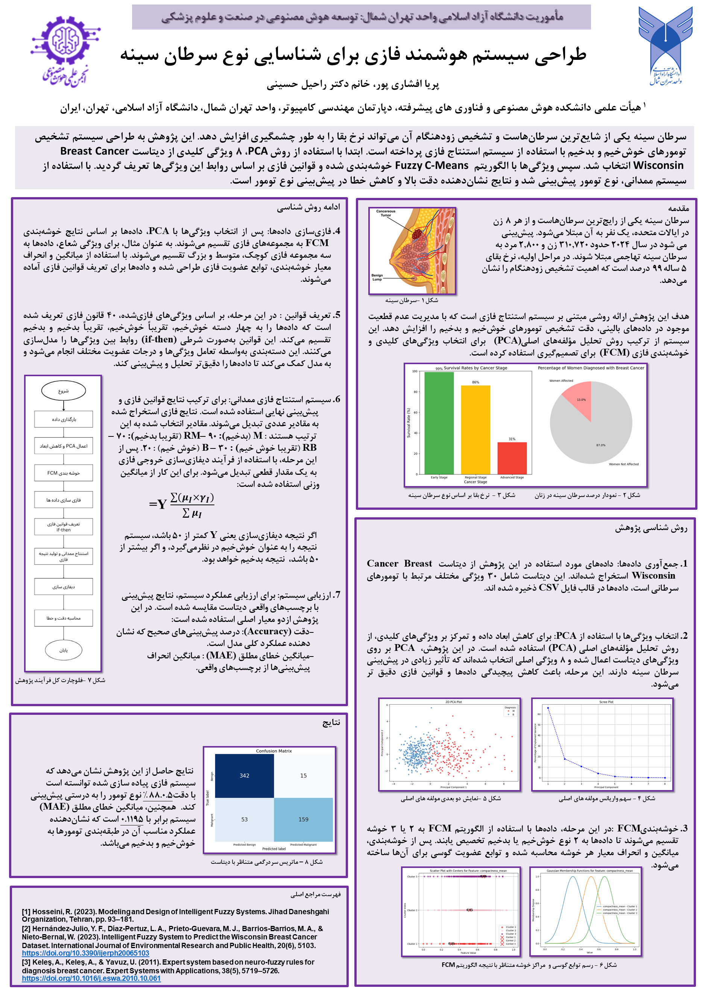

# Breast Cancer Fuzzy System

This project aims to classify breast cancer as **benign** or **malignant** using **fuzzy logic systems**. I’ve implemented various fuzzy inference methods, including the **Mamdani**, **Sugeno**, and **genetic algorithm (GA)** optimization approaches, to predict breast cancer types based on multiple features extracted from cell measurements. All implementations are done on **Google Colab**.

### Project Structure

1. **Data**:
   - The dataset used is the **Breast Cancer Wisconsin (Diagnostic)** dataset, which contains 569 samples with 30 features (e.g., radius, texture, perimeter) for each sample. Each sample is labeled as either benign (B) or malignant (M).
   - **Dataset Link**: [Breast Cancer Wisconsin (Diagnostic) Dataset on Kaggle](https://www.kaggle.com/datasets/uciml/breast-cancer-wisconsin-data)

2. **Fuzzy Logic Models**:
   - **Mamdani Fuzzy System**: A classical fuzzy inference system that uses if-then rules. I implemented the Mamdani approach with the **Pittsburgh** and **Michigan** learning methods.
   - **Sugeno Fuzzy System**: A more advanced fuzzy system where the output is a function of the inputs rather than just a fuzzy category. I implemented the Sugeno model with genetic algorithms for rule optimization.

### Files Overview

1. **کامل.pdf**: Project documentation, including a detailed analysis of the problem, dataset, feature selection, and the fuzzy models applied.
2. **mamdani_pittsburgh.py**: Implementation of the Mamdani fuzzy inference system with a **Pittsburgh** learning approach for optimizing rules using a genetic algorithm.
3. **fuzzy_2_and_compare.py**: Fuzzy system implementation with comparisons of different fuzzy models (Mamdani vs Sugeno) applied to breast cancer classification.
4. **mamdani.py**: Mamdani fuzzy inference system with custom fuzzification rules for input features.
5. **mamdani_michigan.py**: Mamdani fuzzy system using the **Michigan** approach, which optimizes individual fuzzy rules.
6. **sogeno.py**: Sugeno fuzzy inference system with fuzzification of input features and classification output of benign or malignant.
7. **sugeno_ga.py**: Sugeno fuzzy inference system optimized with a **genetic algorithm** for rule base construction and improvement.

### Requirements

- Python 3.x (Google Colab environment)
- Libraries:
  - `pandas`
  - `numpy`
  - `scikit-fuzzy`
  - `kaggle`
  - `sklearn`
  
You can install the required libraries using:

```bash
pip install pandas numpy scikit-fuzzy kaggle scikit-learn
```

### Setup in Google Colab

1. Download the dataset from Kaggle:
   - Set up your Kaggle API key in the Google Colab environment and run the following commands to download the dataset:

   ```bash
   !pip install kaggle
   !mkdir -p ~/.kaggle
   !cp kaggle.json ~/.kaggle/
   !chmod 600 ~/.kaggle/kaggle.json
   !kaggle datasets download -d uciml/breast-cancer-wisconsin-data
   !unzip breast-cancer-wisconsin-data.zip
   ```

2. **Run the Scripts**:
   - Each script contains a specific fuzzy system for classification. You can run them independently to test each model directly in the Colab notebook.

### How to Use

- **Fuzzification**: Each script includes a fuzzification function that transforms continuous feature values (e.g., radius, texture) into fuzzy categories like "low", "medium", and "high".
- **Rule Generation**: The fuzzy inference systems use a set of if-then rules for classification. You can define your rules manually or use a genetic algorithm to optimize the rule base.
- **Model Evaluation**: After running the scripts in Google Colab, the models will output the classification results (benign or malignant) based on the given fuzzy logic rules.

### Results

You can evaluate the models by comparing their accuracy and performance across different fuzzy inference systems. The goal is to optimize the rule base for the highest classification accuracy.


### Event Participation
This project was presented at the Annual Research Projects Event of Islamic Azad University NTB, showcasing the application of fuzzy logic in breast cancer classification.



